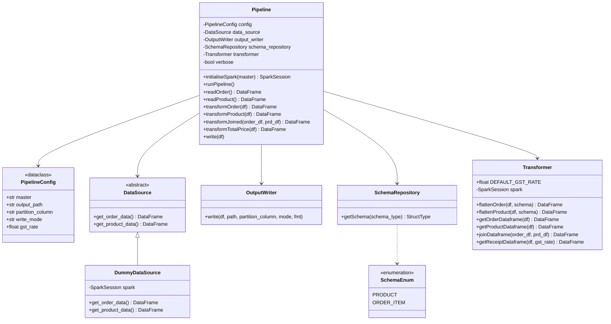

# order_items

A local PySpark batch job that joins order items with product data and computes each
client's total price including GST.

## Architecture

`Pipeline` (`code/core/pipeline/my_pipeline.py`) orchestrates the job but doesn't own any
of the actual logic — everything it needs is injected:

- **`DataSource`** (`code/core/io/data_source.py`) — abstract source of order/product
  data. `DummyDataSource` is the only implementation today (in-memory fixture data); swap
  in a new `DataSource` to read from Parquet/JDBC/etc. without touching `Pipeline`.
- **`SchemaRepository`** (`code/core/schema/schema_repository.py`) — the source of truth
  for the `StructType`/`ArrayType` schemas used to parse the JSON-string columns coming
  out of the data source.
- **`Transformer`** (`code/core/transform/transformer.py`) — the actual Spark
  transformations (flatten, join, aggregate). Pure: no I/O, no printing.
- **`OutputWriter`** (`code/core/io/output_writer.py`) — writes the result DataFrame to a
  sink; format/path/partitioning are all parameters, not hardcoded.
- **`PipelineConfig`** (`code/core/config/pipeline_config.py`) — the one place that holds
  environment-specific knobs (Spark master, output path/partitioning, GST rate).

### UML



## Run locally

```bash
cd code
zip -ru9 core.zip core/
cd ..
spark-submit --master local --py-files code/core.zip code/jobs/driver.py
```

## Tests

```bash
cd code
python -m pytest
```
